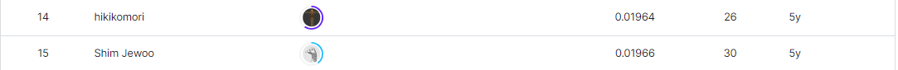

# PUBG Finish Placement Prediction(Kernels Only)
-----------------------------------
# 결과
-----------------------------------
### 요약 정보
  * 도전기관 : SecuLayer
  * 도전자 : 윤민식
  * 최종 스코어 : 0.01964
  * 제출 일자 : 2023-07-20
  * 총 참여 팀수 : 1528
  * 순위 및 비율 : 15 (0.98%)
# 결과 화면
-----------------------------------

# 사용한 방법 & 알고리즘
----------------------------------
  * lightgbm 사용
  * feature 대폭 증대
  * solo, duo, squard 따로 학습 후 병합
# 코드
----------------------------------
[PUBG Finish Placement Prediction(Kernels Only).ipynb](https://github.com/yms0606/SecuLayer/blob/main/PUBG%20Finish%20Placement%20Prediction(Kernels%20Only)/pubg-finish-placement-modeling.ipynb)
# 참고자료
----------------------------------
