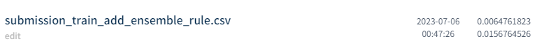
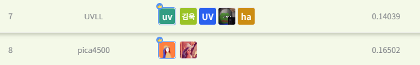

# 2021 Ego-Vision 손동작 인식 AI 경진대회
---
# 결과
---
### 요약 정보
* 도전기관 : 시큐레이어
* 도전자 : 석민재
* 최종 스코어 : 0.0156
* 제출 일자 : 2023-07-04
* 총 참여 팀수 : 290
* 순위 및 비율 : 8 (2.78%)

# 결과 화면
---

# 사용한 방법 & 알고리즘
---
* 증강 기법을 통한 추가적인 데이터 수집
* 5 fold Ensemble 기법 사용

# 코드
---
[jupyter notebook code](main.ipynb)

# 참고자료
---
##### https://github.com/albumentations-team/albumentations
