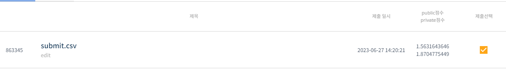
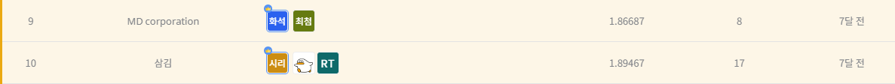

# 2022 UOS 빅데이터 알고리즘 경진대회
-----------------------------------
# 결과
-----------------------------------
### 요약 정보
  * 도전기관 : SecuLayer
  * 도전자 : 윤민식
  * 최종 스코어 : 1.8704
  * 제출 일자 : 2023-06-27
  * 총 참여 팀수 : 705
  * 순위 및 비율 : 10 (1.4%)
# 결과 화면
-----------------------------------

# 사용한 방법 & 알고리즘
----------------------------------
  * proPhet 모델 사용
  * 각 구 별로 데이터 분리
  * 각 데이터 별 예측
  * 데이터 병합 
# 코드
----------------------------------
[2022 UOS 빅데이터 알고리즘 경진대회](./2022_UOS_빅데이터_알고리즘_경진대회.ipynb)
# 참고자료
----------------------------------
