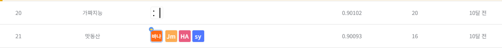

# SW중심대학 공동 AI 경진대회 <예선>
-----------------------------------
# 결과
-----------------------------------
### 요약 정보
  * 도전기관 : SecuLayer
  * 도전자 : 윤민식
  * 최종 스코어 : 0.90102
  * 제출 일자 : 2023-06-29
  * 총 참여 팀수 : 764
  * 순위 및 비율 : 21 (2.7%)
# 결과 화면
-----------------------------------

# 사용한 방법 & 알고리즘
----------------------------------
  * country 결측치, train, test 합친 후 LabelEncoder 사용

     (train['country'].unique() != test['country'].unique() )
  * ExtraTreesClassifier 사용
  * GridSearchCV로 하이퍼 파라미터 튜닝 후 학습
# 코드
----------------------------------
[SW중심대학 공동 AI 경진대회 ❮예선❯.ipynb](./SW중심대학_공동_AI_경진대회_예선.ipynb)
# 참고자료
----------------------------------
