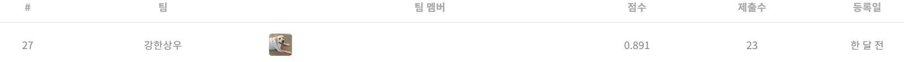

# 월간 데이콘 한국어 문장 관계 분류 경진대회
---
# 결과
---
### 요약 정보
* 도전기관 : 시큐레이어
* 도전자 : 박상우
* 최종 스코어 : 0.891
* 제출 일자 : 2023-01-11
* 총 참여 팀수 : 584
* 순위 및 비율 : 27 (4.6%)

# 결과 화면
---

# 사용한 방법 & 알고리즘
---
* KLUE, 카카오 NLI 데이터 셋을 추가해 Robustness 강화
* Backtrans 기법을 통해 text augmentation 수행 
* Optuna를 사용해 Roberta, Electra 모델 튜닝 후 앙상블 

# 코드
---
[jupyter notebook code](main.ipynb)

# 참고자료
---
##### https://dacon.io/competitions/official/235875/overview/description/
##### https://huggingface.co/
##### https://github.com/kakaobrain/KorNLUDatasets/
