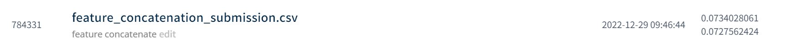
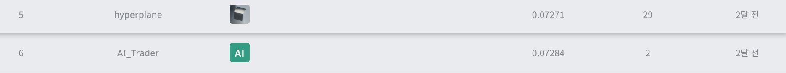

# 감귤 착과량 예측 AI 경진대회
---
# 결과
---
### 요약 정보
* 도전기관 : 시큐레이어
* 도전자 : 박상우
* 최종 스코어 : 0.0734
* 제출 일자 : 2022-12-29
* 총 참여 팀수 : 257
* 순위 및 비율 : 6 (2.3%)

# 결과 화면
---

# 사용한 방법 & 알고리즘
---
* 다양한 feature engineering 수행
* 상관관계 Plot에 따른 Locally fitting
* AutoML 라이브러리 FLAML 사용해서 모델 적합 및 튜닝

# 코드
---
[jupyter notebook code](main.ipynb)

# 참고자료
---
##### https://dacon.io/competitions/official/236038/overview/description
##### https://microsoft.github.io/FLAML/
