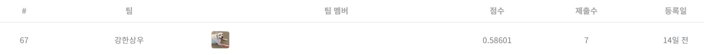

# 건설기계 오일 상태 분류 AI 경진대회
---
# 결과
---
### 요약 정보
* 도전기관 : 시큐레이어
* 도전자 : 박상우
* 최종 스코어 : 0.58601
* 제출 일자 : 2023-02-09
* 총 참여 팀수 : 553
* 순위 및 비율 : 67 (12.1%)

# 결과 화면
---

# 사용한 방법 & 알고리즘
---
* EBM(explainable boosting machine)을 사용해 feature importance 추출
* pycaret과 optuna를 사용해 AutoML 적합 및 튜닝 
* Teacher Model의 정보를 Student Model에게 전달하는 지식 증류 기법 사용 

# 코드
---
[jupyter notebook code](main.ipynb)

# 참고자료
---
##### https://dacon.io/competitions/official/236013/overview/description/
##### https://interpret.ml/
##### https://pycaret.org/
##### https://neptune.ai/blog/knowledge-distillation/