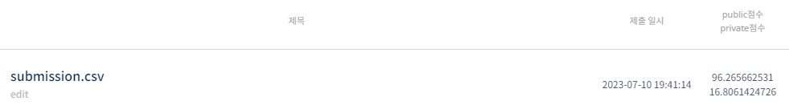
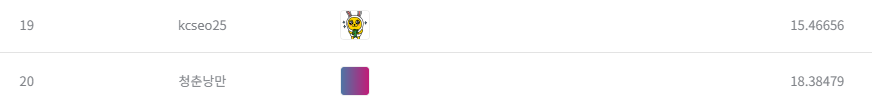

# 모션 키포인트 검출 AI 경진대회
---
# 결과
---
### 요약 정보
* 도전기관 : 시큐레이어
* 도전자 : 석민재
* 최종 스코어 : 16.80
* 제출 일자 : 2023-07-10
* 총 참여 팀수 : 156
* 순위 및 비율 : 20 (12.82%)

# 결과 화면
---

# 사용한 방법 & 알고리즘
---
* Pretrain된 Pose HR-Net 모델 사용
* Normalization, warpAffine 전처리 사용
* Staking Ensemble 사용

# 코드
---
[jupyter notebook code](main.ipynb)

[hrnet_w48-8ef0771d.pth file](https://drive.google.com/file/d/1qm5-QfHTz5Ia71ByZ1Haq5zJpyEbZRoc/view?usp=drive_link)

[pose_hrnet_w48_384x288.pth file](https://drive.google.com/file/d/1UoJhTtjHNByZSm96W3yFTfU5upJnsKiS/view?usp=drive_link)

[w32_384x288_adam_lr1e-3.yaml](https://github.com/leoxiaobin/deep-high-resolution-net.pytorch/blob/master/experiments/coco/hrnet/w32_384x288_adam_lr1e-3.yaml)

# 참고자료
---
##### 
##### https://arxiv.org/pdf/1905.11946.pdf
##### https://github.com/leoxiaobin/deep-high-resolution-net.pytorch
