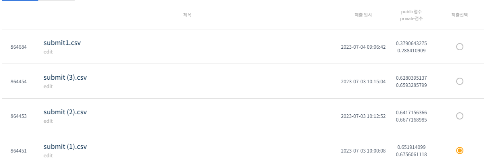
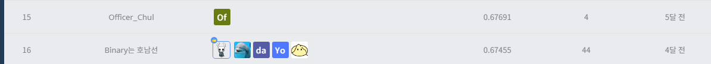

# 스마트 공장 제품 품질 상태 분류 AI 온라인 해커톤
-----------------------------------
# 결과
-----------------------------------
### 요약 정보
  * 도전기관 : SecuLayer
  * 도전자 : 윤민식
  * 최종 스코어 : 0.67560
  * 제출 일자 : 2023-07-03
  * 총 참여 팀수 : 1054
  * 순위 및 비율 : 16 (1.5%)
# 결과 화면
-----------------------------------

# 사용한 방법 & 알고리즘
----------------------------------
  * 비슷한 개수의 변수를 가진 라인 별로 모아서 전처리
  * 각 라인별 LGBM, XGB, LandomForest 사용해 학습
# 코드
----------------------------------
[스마트 공장 제품 품질 상태 분류 AI 온라인 해커톤.ipynb](./스마트_공장_제품_품질_상태_분류_AI_온라인_해커톤.ipynb)
# 참고자료
----------------------------------
