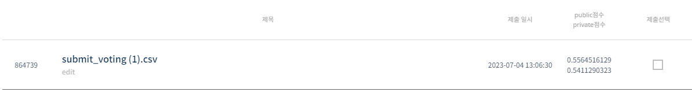
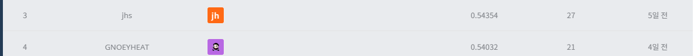

# 월간 데이콘 법원 판결 예측 AI 경진대회
-----------------------------------
# 결과
-----------------------------------
### 요약 정보
  * 도전기관 : SecuLayer
  * 도전자 : 윤민식
  * 최종 스코어 : 0.54112
  * 제출 일자 : 2023-07-03
  * 총 참여 팀수 : 822
  * 순위 및 비율 : 4 (0.4%)
# 결과 화면
-----------------------------------

# 사용한 방법 & 알고리즘
----------------------------------
  * text_hammer 사용해서 텍스트 전처리(불필요 단어 제거)
  * facts의 길이가 짧은 행들 제외
  * TfidVectorizer 사용해 train과 target 저장
  * 여러 분류 모델 학습
  * VotingClassifier로 종합 학습
# 코드
----------------------------------
[월간 데이콘 법원 판결 예측 AI 경진대회.ipynb](./월간_데이콘_법원_판결_예측_AI_경진대회.ipynb)
# 참고자료
----------------------------------
