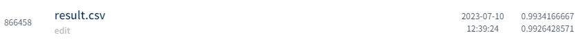
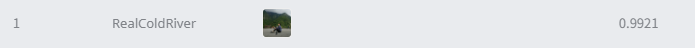

# 월간 데이콘 숫자 3D 이미지 분류 AI 경진대회
---
# 결과
---
### 요약 정보
* 도전기관 : 시큐레이어
* 도전자 : 석민재
* 최종 스코어 : 0.9926
* 제출 일자 : 2023-07-10
* 총 참여 팀수 : 165
* 순위 및 비율 : 1 (0.6%)

# 결과 화면
---

# 사용한 방법 & 알고리즘
---
* 3D Random Rotation value를 Regression 모델을 통해 판단
* Rotation Value 판단시 cascade inference 사용
* Rotation Value를 통해 3D 이미지를 2D 이미지로 변환
* 2D 이미지를 MnistSimpleCNN을 통해 분류
* 분류시, Seed값이 다르게 해 10번을 학습시킨 후, 해당 결과값들을 Ensemble

# 코드
---
[jupyter notebook code](main.ipynb)

# 참고자료
---
##### https://github.com/ansh941/MnistSimpleCNN
##### https://arxiv.org/abs/2103.16317
