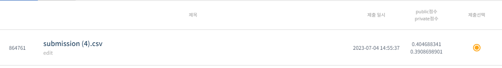

# 월간 데이콘 천체 유형 분류 대회
-----------------------------------
# 결과
-----------------------------------
### 요약 정보
  * 도전기관 : SecuLayer
  * 도전자 : 윤민식
  * 최종 스코어 : 0.39086
  * 제출 일자 : 2023-07-04
  * 총 참여 팀수 : 1196
  * 순위 및 비율 : 145 (12.1%)
# 결과 화면
-----------------------------------

# 사용한 방법 & 알고리즘
----------------------------------
  * StandardScaler 사용해 정규분포에 맞춘 수치화
  * tensorflow 신경망 구축 후 학습
# 코드
----------------------------------
[월간 데이콘 천체 유형 분류 대회](./월간 데이콘 천체 유형 분류 대회.ipynb)
# 참고자료
----------------------------------
