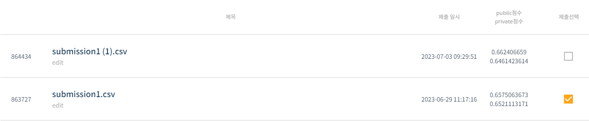
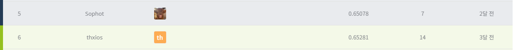

# 월간 데이콘 항공편 지연 예측 AI 경진대회
-----------------------------------
# 결과
-----------------------------------
### 요약 정보
  * 도전기관 : SecuLayer
  * 도전자 : 윤민식
  * 최종 스코어 : 0.65211
  * 제출 일자 : 2023-06-29
  * 총 참여 팀수 : 1246
  * 순위 및 비율 : 6 (0.4%)
# 결과 화면
-----------------------------------

# 사용한 방법 & 알고리즘
----------------------------------
  * 불필요한 열 정리
  * NULL값 채우고 범주형 -> 수치형 데이터로 변경
  * XGBClassifier 사용
  * GridSearchCV 사용해 하이퍼 파라미터 튜닝
# 코드
----------------------------------
[월간 데이콘 항공편 지연 예측 AI 경진대회.ipynb](./월간_데이콘_항공편_지연_예측_AI_경진대회.ipynb)
# 참고자료
----------------------------------
