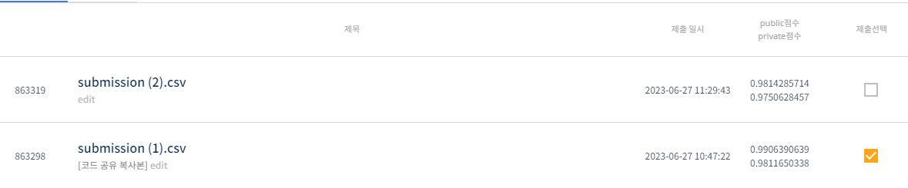
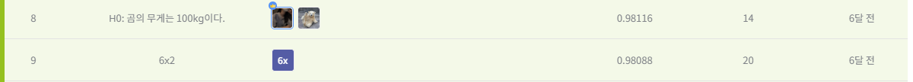

# 유전체 정보 품종 분류 AI 경진대회
-----------------------------------
# 결과
-----------------------------------
### 요약 정보
  * 도전기관 : SecuLayer
  * 도전자 : 윤민식
  * 최종 스코어 : 0.98116
  * 제출 일자 : 2023-06-27
  * 총 참여 팀수 : 1283
  * 순위 및 비율 : 9(0.7%)
# 결과 화면
-----------------------------------

# 사용한 방법 & 알고리즘
----------------------------------
  * XGBoost 사용
  * LabelEncoder를 통한 유전 정보 수치화
  * combinations을 통한 샘플링
  * 샘플링 각각을 대상으로 모델 학습
  * GridSearchCV 사용해 최적화 하이퍼 파라미터 탐색
  * 찾은 하이퍼 파라미터 값으로 예측
# 코드
----------------------------------
[유전체 정보 품종 분류 AI 경진대회](./유전_정보_품종_분류_AI_경진대회.ipynb)
# 참고자료
----------------------------------
