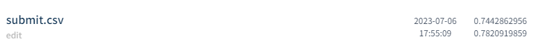
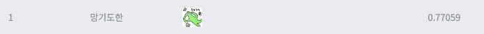

# 제1회 코스포 x 데이콘 자동차 충돌 분석 AI경진대회
---
# 결과
---
### 요약 정보
* 도전기관 : 시큐레이어
* 도전자 : 석민재
* 최종 스코어 : 0.7820
* 제출 일자 : 2023-07-06
* 총 참여 팀수 : 449
* 순위 및 비율 : 1 (0.22%)

# 결과 화면
---

# 사용한 방법 & 알고리즘
---
* Non-crash(label 0)를 weather, timing으로 자체적으로 라벨링 실행
* 라벨 구분이 어려운 데이터 제거
* SlowFast 모델 사용

# 코드
---
[jupyter notebook code](main.ipynb)

# 참고자료
---
##### https://arxiv.org/abs/1812.03982
