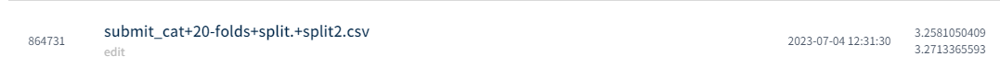
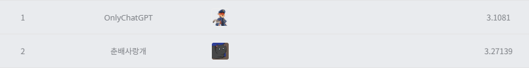

# 제2회 코스포 x 데이콘 도서 추천 알고리즘 AI경진대회
---
# 결과
---
### 요약 정보
* 도전기관 : 시큐레이어
* 도전자 : 석민재
* 최종 스코어 : 3.2713
* 제출 일자 : 2023-07-04
* 총 참여 팀수 : 679
* 순위 및 비율 : 2 (0.29%)

# 결과 화면
---

# 사용한 방법 & 알고리즘
---
* 범주형 변수들을 cat_features에 추가
* optuna를 통해 모델 하이퍼파라미터 선정
* K-fold(n_split=20)를 사용, 20개의 output 생성 후, 결과값의 평균을 최종 output으로 사용

# 코드
---
[jupyter notebook code](main.ipynb)

# 참고자료
---
##### https://arxiv.org/abs/1706.09516
##### https://github.com/optuna/optuna
