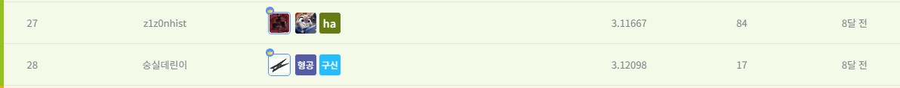

# 제주도 도로 교통량 예측 AI 경진대회
---
# 결과
---
### 요약 정보
* 도전기관 : 시큐레이어
* 도전자 : 이수빈
* 최종 스코어 : 3.1169
* 제출 일자 : 2023-02-23
* 총 참여 팀수 : 1551
* 순위 및 비율 : 28 (1.8%)

# 결과 화면
---



# 사용한 방법 & 알고리즘
---
* "Road_name" 변수 결측값 대체를 위한 여러 변수 조합
* Optuna를 통해 5개 모델 하이퍼파라미터 튜닝 진행
* StratifiedKFold(K=10)를 사용한 XGBoost 모델 성능이 가장 좋았음 

# 코드
---
[jupyter notebook code](main.ipynb)

# 참고자료
---
##### https://dacon.io/competitions/official/235985/overview/description

```python

```
