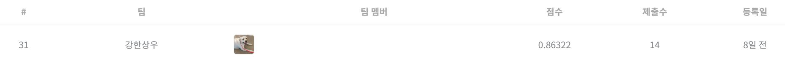

# 월간 데이콘 Computer Vision 이상치 탐지 알고리즘 경진대회 
---
# 결과
---
### 요약 정보
* 도전기관 : 시큐레이어
* 도전자 : 박상우
* 최종 스코어 : 0.86322
* 제출 일자 : 2023-02-15
* 총 참여 팀수 : 570
* 순위 및 비율 : 31 (5.4%)

# 결과 화면
---

# 사용한 방법 & 알고리즘
---
* Randaug, Albumentation을 이용해 augmentation 수행 
* EfficientNet, Cait 등 다양한 모델 고도화 
* TTA를 사용해 Generalization

# 코드
---
[python code](main.ipynb)

# 참고자료
---
##### https://dacon.io/competitions/official/235894/overview/description
##### https://albumentations.ai/
##### https://github.com/kakaobrain/KorNLUDatasets/
