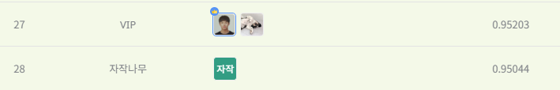
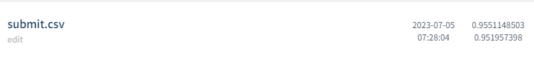

# 합성데이터 기반 객체 탐지 AI 경진대회
---
# 결과
---
### 요약 정보
* 도전기관 : 시큐레이어
* 도전자 : 석민재
* 최종 스코어 : 0.9519
* 제출 일자 : 2023-07-04
* 총 참여 팀수 : 855
* 순위 및 비율 : 28 (3.27%)

# 결과 화면
---

# 사용한 방법 & 알고리즘
---
* YOLOv8 사용
* 데이터 증강 기법 중 BLUR, CLAHE. ToGray 사용

# 코드
---
[jupyter notebook code](main.ipynb)

# 참고자료
---
##### https://github.com/ultralytics/ultralytics
