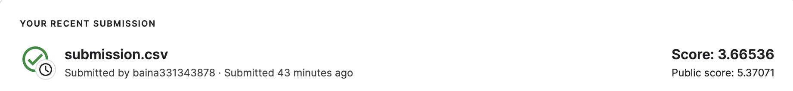
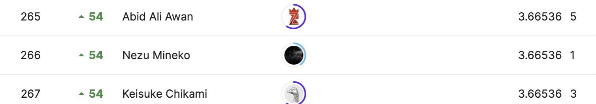

# Google Smartphone Decimeter Challenge
# 결과
---
### 요약 정보
* 도전기관 : 한양대학교
* 도전자 : 백나
* 최종 스코어 : 3.66536
* 제출 일자 : 2023-02-11
* 총 참여 팀수 : 810
* 순위 및 비율 : 265 (32.7%)

# 결과 화면
---

# 사용한 방법 & 알고리즘
 *linear algebra사용.
 *feature engineering：Temporal periodicity；sensor data；
    -Filter correlation feature；millisSinceGpsEpoch groupby data.
 *지구상의 두 지점 사이의 대권 거리를 계산한다. 입력은 배열과 유사하며 십진수로 지정되다.
 *Kalman Filter사용:최적의 시스템 상태는 오류 영향을 받은 센서 측정값에서 추정되다.

# 코드
---
[`./google.ipynb`](./google.ipynb)

# 참고자료
---
data categories(3): 
 https://www.kaggle.com/c/google-smartphone-decimeter-challenge/discussion/245160
 http://t.csdn.cn/unHqq
