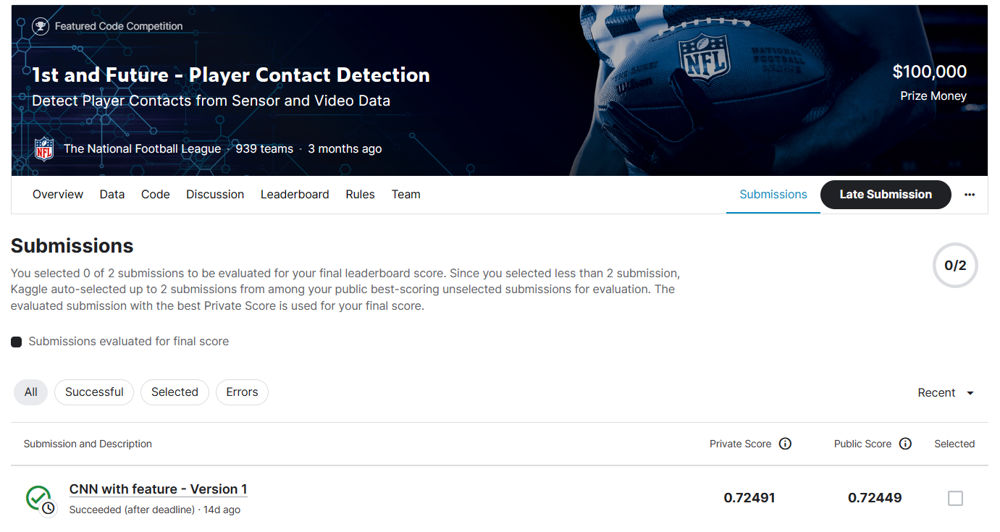

# 1st and Future - Player Contact Detection

---

# 결과

---

### 요약 정보

* 도전기관 : 한양대학교
* 도전자 : 주흠해
* 최종 스코어 :  0.72491
* 제출 일자 : 2023-05-24
* 총 참여 팀수 : 940
* 순위 및 비율 : 48(5.1%)

# 결과 화면

# 사용한 방법 & 알고리즘

---

* CNN+xgboost
* Use ffmpeg to split a video into pictures
* The predicted value of the CNN model is taken as the principal component, and the xgboost model is used to make the final prediction

# 코드

[Player Contact Detection](./cnn-with-feature.ipynb)

# 참고자료

Using idea from: 

[Getting Started]([NFL Player Contact Detection - Getting Started | Kaggle](https://www.kaggle.com/code/robikscube/nfl-player-contact-detection-getting-started#What-is-the-goal-of-this-competition?))

xgboost model:

[][1603.02754v3.pdf (arxiv.org)](https://arxiv.org/pdf/1603.02754v3.pdf)

