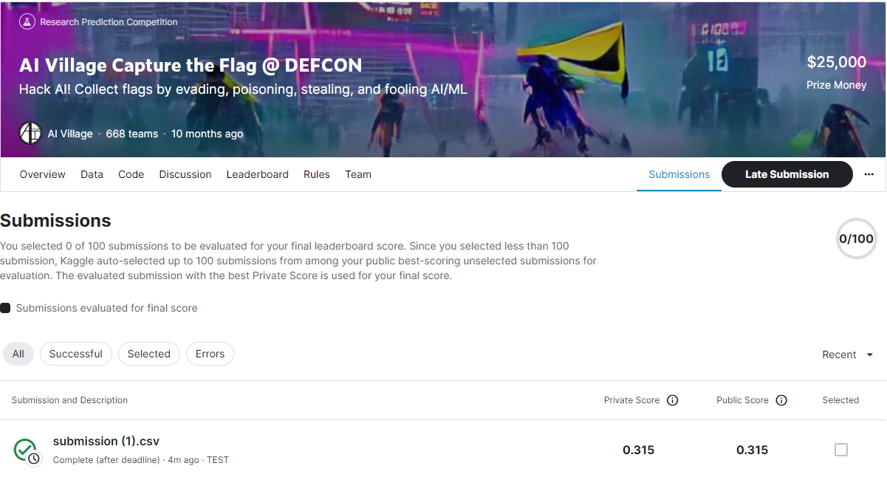
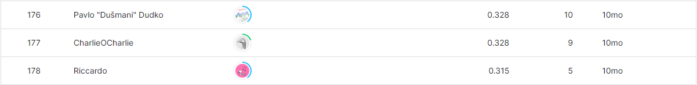

# ai-village-ctf

---

# 결과

---

### 요약 정보

* 도전기관 : 시큐레이어
* 도전자 : 이준영
* 최종 스코어 : 0.315
* 제출 일자 : 2023-06-28
* 총 참여 팀수 : 668
* 순위 및 비율 : 178(26.65%)

# 결과 화면

# 사용한 방법 & 알고리즘

---

* MobileNet Model
* Embedding Layer
* LSTM Layer

# 코드
[ai-village-ctf](./ai-ctf-submissions.ipynb)

# 참고자료