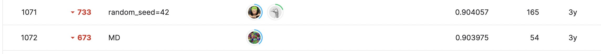

# APTOS 2019 Blindness Detection
---
# 결과
---
### 요약 정보
* 도전기관 : 시큐레이어
* 도전자 : 이수빈
* 최종 스코어 : 0.9040
* 제출 일자 : 2023-02-23
* 총 참여 팀수 : 2928
* 순위 및 비율 : 1072 (36.6%)

# 결과 화면
---



# 사용한 방법 & 알고리즘
---
* preprocessing : Crop out black borders, Resize images to the same size, Gaussian Filter
* transfer learning : EfficientNetB5
* class weights, TTA 기법을 모두 적용해보았으나 성능에 있어서 큰 차이는 없었음 

# 코드
---
[jupyter notebook code](main.ipynb)

# 참고자료
---
##### https://www.kaggle.com/competitions/aptos2019-blindness-detection
##### https://arxiv.org/abs/1905.11946

```python

```
