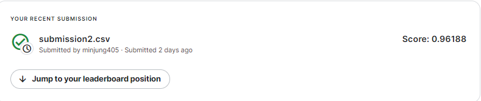

# Bag of Words Meets Bags of Popcorn
---
# 결과
---
### 요약 정보
* 도전기관 : 한양대학교
* 도전자 : 김민정
* 최종 스코어 : 0.961
* 제출 일자 : 2023-02-14
* 총 참여 팀수 : 577
* 순위 및 비율 : 60 (10.4%)

# 결과 화면
---

# 사용한 방법 & 알고리즘
---
* 데이터 추가해서 원래 train data와 합치기
* Data Preprocessing
	- 소문자로 변경
	- 영어가 아닌 문자 제거
	- 형태소 분리
	- 불용어 제거
	- 정수 인코딩 및 패딩
* Bi-LSTM 모델 사용

# 코드
---
[jupyter notebook code](Bag of Words Meets Bags of Popcorn_git.ipynb)
