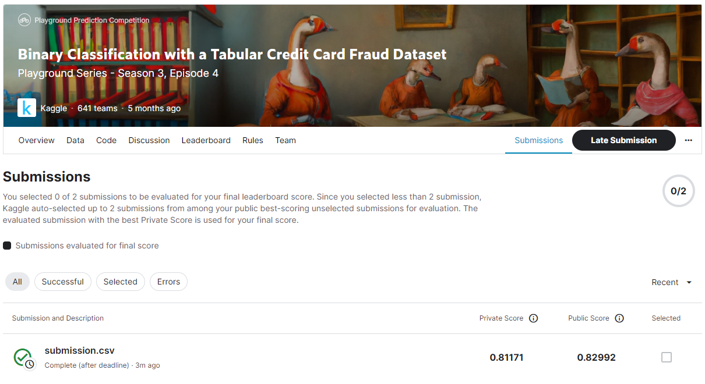
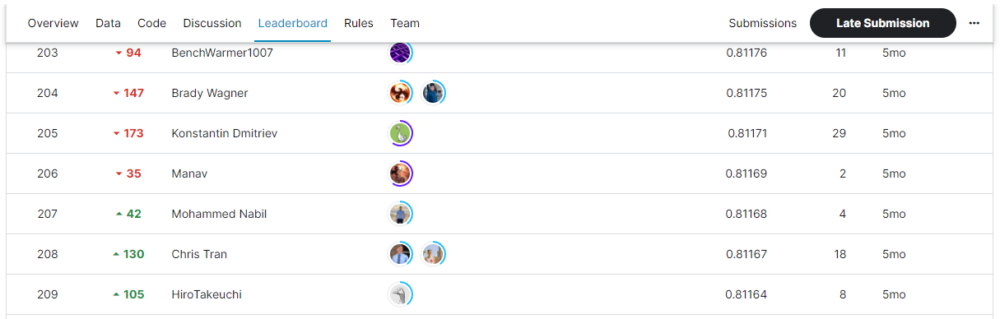

# Binary Classification with a Tabular Credit Card Fraud Dataset
## 결과
### 요약 정보
- 도전기관 : SecuLayer
- 도전자 : 김소영
- 최종 스코어 : 0.81171
- 제출 일자 : 2023-07-10
- 총 참여 팀수 : 641
- 순위 및 비율 : 206(32.1%)

## 결과 화면

## 사용한 방법 & 알고리즘
- Step 1. 데이터 전처리
- Step 2. 모델: Train XGBoost, LightGBM, CatBoost Model

## 코드
- Binary_Classification_with_a_Tabular_Credit_Card_Fraud_Dataset.ipynb