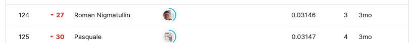
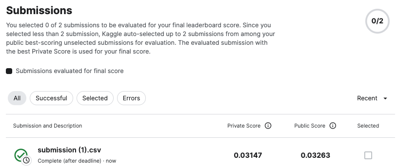
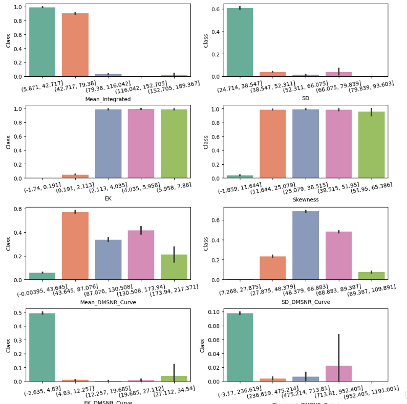
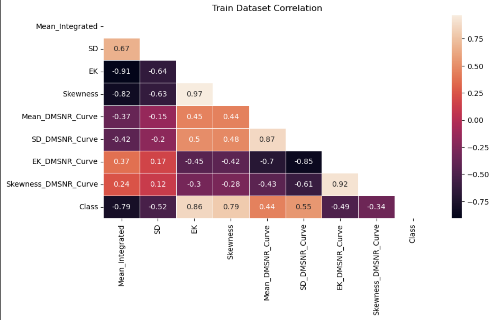

# Binary Classification with a Tabular Pulsar Dataset

## 요약 정보
* 도전기관 : 시큐레이어
* 도전자 : 이정환
* 최종 스코어 : 0.03147
* 제출 일자 : 2023-06-27
* 총 참여 팀수 : 807
* 순위 및 비율 : 125 (15.48%)
___
## 결과 화면

___
## 대회 개요
- 주어진 정형 데이터를 활용해 개별 인스턴스가 Pulsar(중성자별)에 해당되는지 분류하는 것이 목적
___
## 사용한 방법 & 알고리즘
### **[3 Boosting Algorithm Ensemble]**  
**Stage 0. Feature Selection**
* **Target & Continuous Feature Ratio Analysis**

    - 주어진 피처 모두 연속형 데이터
        - 구간별 데이터로 바꾸기
        - 구간별 타겟 클래스 비중 시각화
        - 모든 피처 & 구간이 타겟 클래스에 대해 유효한 설명력을 갖는 것으로 판단, 피처 제거 x

* **Correlation Analyisis**

    - 같은 방향의 상관관계를 갖는 피처를 찾고, 그 중 일부를 삭제해 훈련 및 메모리 효율성을 도모하기 위해 분석
        - 상관 관계가 같은 방향, 다른 방향을 갖는 피처쌍이 매우 많음
        - 한개씩 추가해보면서 삭제를 해봤으나, 오히려 분류 성능이 떨어지는 현상 발견
        - 또한 Feature Ratio Analysis 결과를 고려해보면 모든 피처를 삭제하지 않는 것이 맞다고 판단
* **Find Feature Importances by XGBoost**  

    - EK, SD 등이 분류에 중요한 것으로 분석

**Stage 1. Ensemble OOF 3 Boosting Algorithm**
* **XGBoost**  
* **CatBoost**  
* **LightGBM**  
___
# 참고자료  
##### https://www.kaggle.com/competitions/playground-series-s3e10
##### https://catboost.ai/en/docs/concepts/python-reference_catboostregressor_fit#use_best_model  
##### https://lightgbm.readthedocs.io/en/latest/pythonapi/lightgbm.LGBMRegressor.html
___