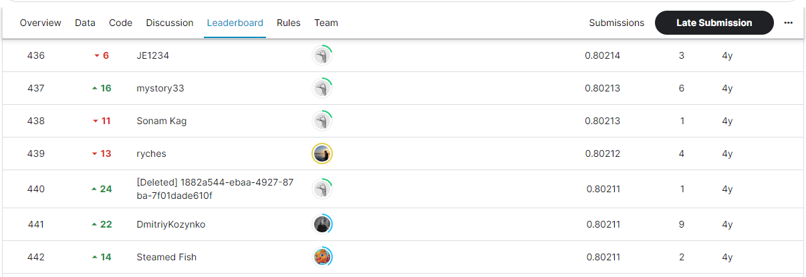

# Categorical Feature Encoding Challenge
## 결과
### 요약 정보
- 도전기관 : SecuLayer
- 도전자 : 김소영
- 최종 스코어 : 0.80213
- 제출 일자 : 2023-07-06
- 총 참여 팀수 : 1,338
- 순위 및 비율 : 439(32.8%)

## 결과 화면

## 사용한 방법 & 알고리즘
- Step 1. 데이터 전처리: One-Hot Encode
- Step 2. LogisticRegression 모델(CV=5)

## 코드
- Categorical_Feature_Encoding_Challenge.ipynb
