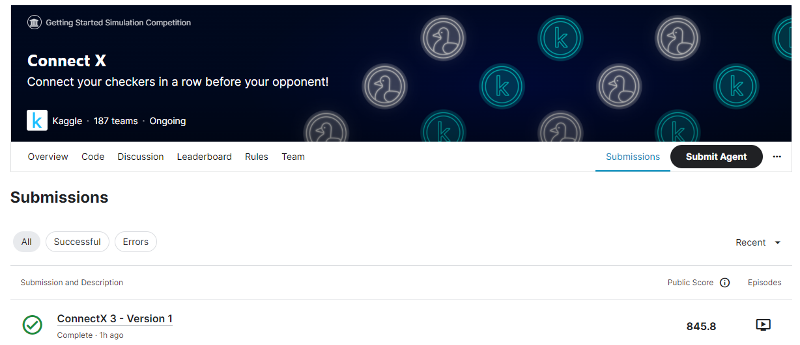

# Connect-X
---
# 결과
---
## 요약 정보
● 도전자 : 문시영  
● 최종 스코어 : 845.8  
● 제출 일자 : 2023-06-27  
● 총 참여 팀수 : 187  
● 순위 및 비율 : 42(22.04%)

# 결과 화면

# 사용한 방법 & 알고리즘
---
● Minimax 알고리즘  
● AI agent
# 코드
---
[jupyter lab code](connetx.ipynb)
# 참고자료
---
