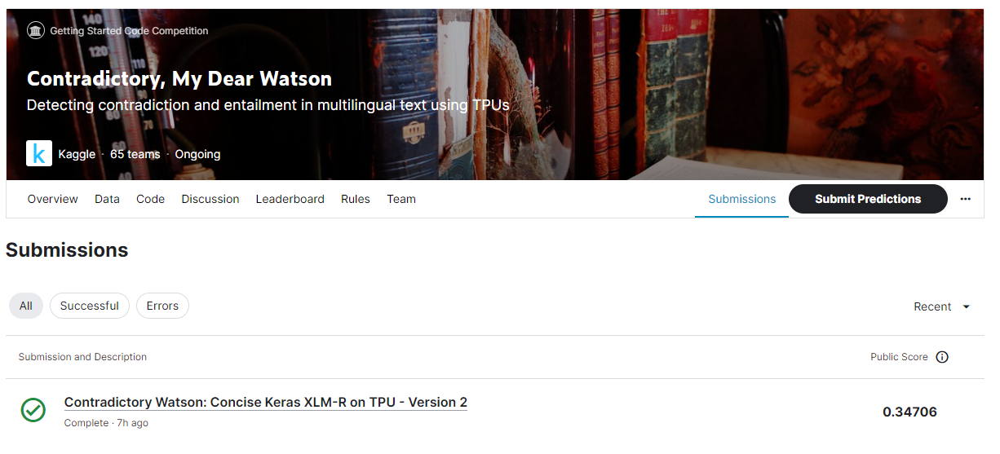

# Contradictory, My Dear Watson

---

# 결과

---

### 요약 정보

* 도전기관 : 시큐레이어
* 도전자 : 장석주
* 최종 스코어 : 0.34706
* 제출 일자 : 2023-06-28
* 총 참여 팀수 : 65
* 순위 및 비율 : 57(87.7%)

# 결과 화면

# 사용한 방법 & 알고리즘

---

* Contextualized Word Embedding
* Transformer Encoder
* XLM-RoBERTa Model

# 코드

[Contradictory, My Dear Watson - XLM-RoBERTa](./contradictory-watson-xlm-r.ipynb)

# 참고자료

XLM-RoBERTa Model:

##### https://huggingface.co/jplu/tf-xlm-roberta-large
