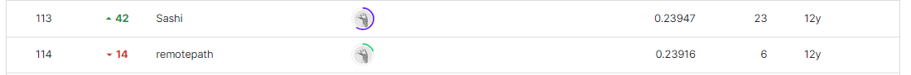

# Don't Get Kicked!
-----------------------------------
# 결과
-----------------------------------
### 요약 정보
  * 도전기관 : SecuLayer
  * 도전자 : 윤민식
  * 최종 스코어 : 0.23923
  * 제출 일자 : 2023-08-02
  * 총 참여 팀수 : 570
  * 순위 및 비율 : 114 (20.0%)
# 결과 화면
-----------------------------------

# 사용한 방법 & 알고리즘
----------------------------------
  * lightgbm + catboost 앙상블
  * 다양한 방식의 데이터 전처리
# 코드
----------------------------------
[Don't Get Kicked!.ipynb](https://github.com/yms0606/SecuLayer/tree/main/Don't%20Get%20Kicked!)
# 참고자료
----------------------------------
