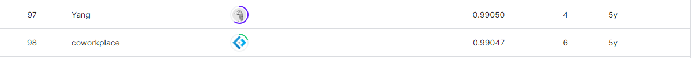

# Don't call me turkey!
-----------------------------------
# 결과
-----------------------------------
### 요약 정보
  * 도전기관 : SecuLayer
  * 도전자 : 윤민식
  * 최종 스코어 : 0.99048
  * 제출 일자 : 2023-07-10
  * 총 참여 팀수 : 266
  * 순위 및 비율 : 98 (36.8%)
# 결과 화면
-----------------------------------

# 사용한 방법 & 알고리즘
----------------------------------
  * Bidirectional을 사용해 신경망 구축
  * MaxPooling과 AveragePooling 결합해 Pooilng 구축
  * pad sequnces 사용
# 코드
----------------------------------
[dont call me turkey](https://github.com/yms0606/SecuLayer/blob/main/Don't%20call%20me%20turkey!/Dont%20call%20me%20turkey.ipynb)
# 참고자료
----------------------------------
