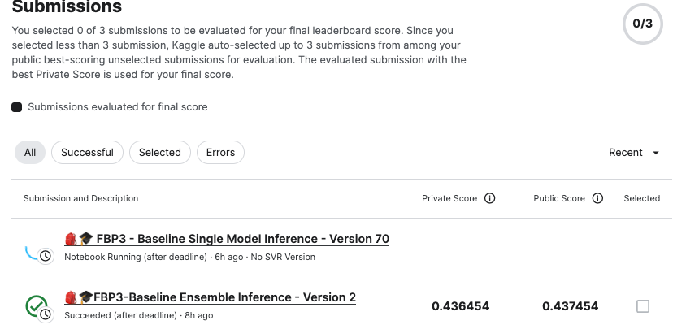
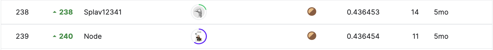

# FeedBackPrize - English Language Learning

## 요약 정보
* 도전기관 : 시큐레이어
* 도전자 : 이정환
* 최종 스코어 : 0.436454
* 제출 일자 : 2023-04-24
* 총 참여 팀수 : 2654
* 순위 및 비율 : 239 (9.00%)
___
## 결과 화면

___
## 대회 개요
- 초등학생의 작문 숙제 데이터를 활용, 6가지 평가 요소를 자동으로 예측하는 모델을 구축하는 것이 목적
___
## 사용한 방법 & 알고리즘
### **[Various Model Ensemble]**  
**Type 1. From Meta-Pseudo Label, Make Various Model**  
* **Make Best Single Fine-Tuned Model from Competition Data**
    - Backbone: DeBERTa-V3-Large
    - Pooling: MeanPooling
    - Loss: SmoothL1Loss
* **Make Student Model from Meta-Pseudo Labeling**
    - Un-Supervised Dataset: FBP1, FBP2 Competition Dataset
    - StudentModel Backbone: DeBERTa-V3-Large
    - Loss: WeightedMCRMSE  
        (For transfer FBP3 data's distribution to FBP1, FBP2)
    - Metrics: MCRMSE from FBP3 data
* **Fine-Tuned by FBP3 data with Student Model**
    - Backbone: student model with trained by Meta-Pseudo Label 
    - Various Pooling: MeanPool, GEMPool, WeightedLayerPool, AttentionPool
    - Various Sequence Length: 512, 756, 1024, 1536(max length of data)
    - Loss: SmoothL1Loss
    - Metrics: MCRMSE
    - Apply Freeze & Re-Init Encoders
    - Apply Layer Wise Learning Rate Decay

**Type 2. Only Labeled Data, Make Various Model**  
* **Make various Fine-Tuned Model from Competition Data**
    - Backbone: DeBERTa-V3-Large
    - Various Pooling: MeanPool, GEMPool, WeightedLayerPool, AttentionPool
    - Various Sequence Length: 512, 756, 1024, 1536(max length of data)
    - Loss: SmoothL1Loss
    - Metrics: MCRMSE
    - Apply Freeze & Re-Init Encoders
    - Apply Layer Wise Learning Rate Decay

**Type 3. Add RAPID's Support Vector Regressor Head**  
* **Model 1.Extract Embedding with Pretrained Model NOT Fine-Tuned with Competition Data**
    - Backbone: DeBERTa-V3-Large
    - Various Pooling: MeanPool, GEMPool, WeightedLayerPool(two different verison), AttentionPool
    - Various Sequence Length: 640
    - Concatenate Embedding from Five different Pooling
    - Regression with RAPID's SVR

* **Model 2.Extract Embedding with Pretrained Model Fine-Tuned with Competition Data**
    - Backbone: Fine-Tuned DeBERTa-V3-Large
    - Various Pooling: MeanPool, GEMPool, WeightedLayerPool(two different verison), AttentionPool
    - Various Sequence Length: 640
    - Concatenate Embedding from Five different Pooling
    - Regression with RAPID's SVR

___
# 참고자료  
##### https://www.kaggle.com/competitions/mayo-clinic-strip-ai/overview
##### https://www.kaggle.com/competitions/feedback-prize-english-language-learning/discussion/351577
##### https://www.kaggle.com/competitions/feedback-prize-english-language-learning/discussion/369609
##### https://arxiv.org/abs/2003.10580
##### https://arxiv.org/pdf/1904.12848v6.pdf
##### https://arxiv.org/abs/1711.02512
##### https://arxiv.org/abs/1810.04805
___