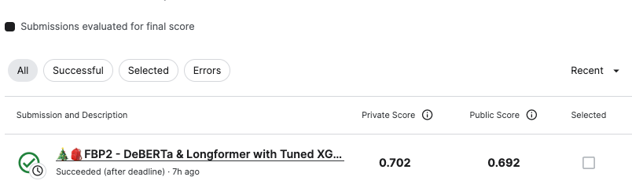

# Feedback Prize - Evaluating Student Writing

## 요약 정보
* 도전기관 : 시큐레이어
* 도전자 : 이정환
* 최종 스코어 : 0.702
* 제출 일자 : 2023-06-27
* 총 참여 팀수 : 2058
* 순위 및 비율 : 195 (9.5%)
___
## 결과 화면

___
## 대회 개요
- 6~12학년 수준의 학생들이 작성한 작문 과제를 논증 및 수사학적 요소를 기준으로 하위 여러 문단으로 분할
___
## 사용한 방법 & 알고리즘
### **Two Stage Modeling (NER & Setnence Classification)**  
**Part 0. Text Preprocessing**
* **No Cleaning & Normalizing for Text Data**
    - Stage 1에서 NER Task를 수행해 LM을 Fine-Tuning할 예정이라서 최대한 주어진 텍스트 원본을 유지
    - 최대한 truncation & padding 피하기 위해서 sequence length 4096까지 가능한 DeBERTa-Large, BigBird, Longformer 사용 고려 
    
**Stage 1. NER Task Pipeline**  
* **Training Config**
    - Backbone: DeBERTa-V3-Large
    - Tokenizer: FastTokenizer for offset mapping
    - Style: B.I.O Style NER Task
    - Loss: Cross Entropy
    - Metrics: Macro F1-Score (Transformed For Competition)
    - Pytorch Mixed Precision, Gradient Clipping
    - Apply Freeze & Re-Init Encoders
    - Apply Layerwise Learning Rate Decay
    - Train Max length: 2048
    - Inference Max length: 4096 
    - Batch Size: 8  
    - Cross Validation: 5 Fold & Out of Folds
* **Make Sequence Dataset(Beam Search Coding Style)**
    - 대회 매트릭 산출은 개별 토큰 단위가 아니라 시퀀스 단위를 대상으로 이뤄짐
        - 즉, 개별 토큰이 정확히 어느 라벨에 속하는지 보다 문장의 유형별 시작과 끝을 정확히 맞추는 것이 더욱 중요
        - Greedy하게 개별 토큰의 가장 높은 확률값만 클래스 결정값으로 사용한다면 Global Optimal에 도달하지 못할 가능성이 높음  
        (Beam Search Coding)
    - 따라서, 개별 클래스에 대한 확률값을 이용해 가능한 모든 Sequence 조합을 생성해 새로운 데이터 세트를 도출
        - NER Task를 통해 Fine-Tuned된 모델 활용, 원본 훈련 데이터의 50%에 대한 Inference 수행
        - discourse_type별로 Positive & Negative Sample 생성, 타입별로 생성된 데이터 세트를 통해 XGBoost Tuning
**Stage 2. Sequence Classification Pipeline**  
* **Training Config**
    - Classifier: XGBoost
    - Style: B.I.O Style NER Task
    - Negative Sampling Ratio: 10
    - learning_rate: 0.05,
    - eval_metric: logloss,
    - tree_method: hist,
    - random_state: 42,
    - n_jobs: -1,
___
# 참고자료  
##### https://arxiv.org/abs/2004.05150
##### https://arxiv.org/pdf/2007.14062.pdf
##### https://huggingface.co/learn/nlp-course/chapter7/2?fw=pt
##### https://huggingface.co/docs/transformers/main_classes/tokenizer
##### https://arxiv.org/abs/1702.01806
##### https://amber-chaeeunk.tistory.com/94
##### 
___