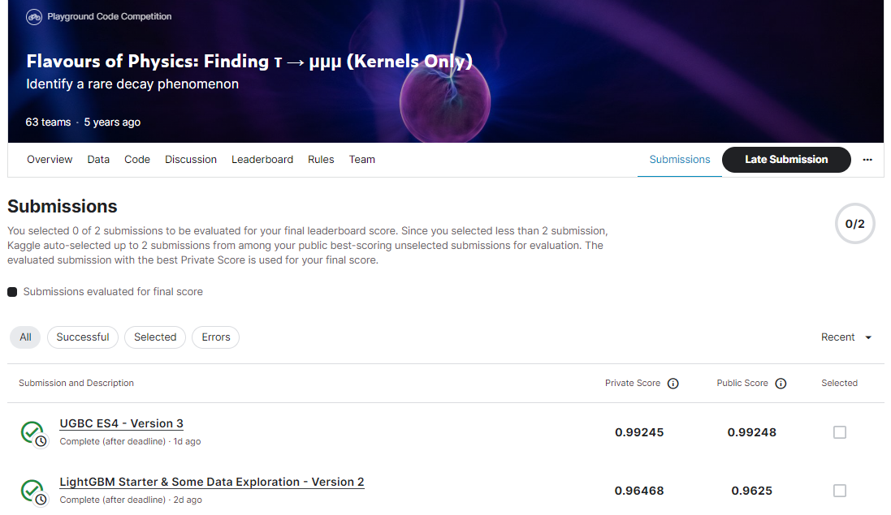
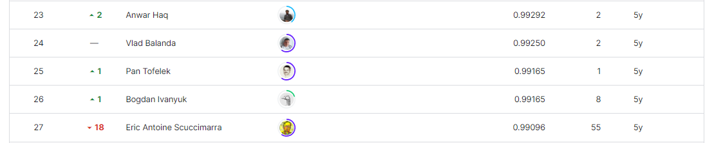

# Flavours of Physics: Finding τ → μμμ (Kernels Only)
---
# 결과
---
## 요약 정보
● 도전기관 : Seculayer  
● 도전자 : 김유강  
● 최종 스코어 : 0.99245  
● 제출 일자 : 2023-06-28  
● 총 참여 팀수 : 63  
● 순위 및 비율 : 25(38.71%)

# 결과 화면

# 사용한 방법 & 알고리즘
---

# 코드
---
[py code](ugbc_es4.py)