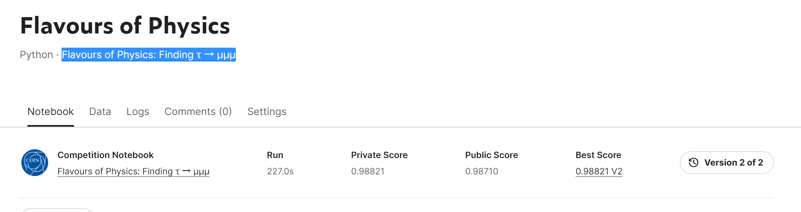

# Flavours of Physics Finding τ → μμμ
---
# 결과
---
### 요약 정보
* 도전기관 : 한양대학교
* 도전자 : 김용환
* 최종 스코어 :  0.98821
* 제출 일자 : 2023-01-29
* 총 참여 팀수 : 673
* 순위 및 비율 : 129 (19.10%)

# 결과 화면

# 사용한 방법 & 알고리즘
---
* Random Forest model and XGBoost model
* After adding and removing some value data, two models were used for training

# 코드
---
[jupyter notebook code](flavours-of-physics.ipynb)

# 참고자료
---
Add the features: https://www.kaggle.com/code/rakhlin/abcde

