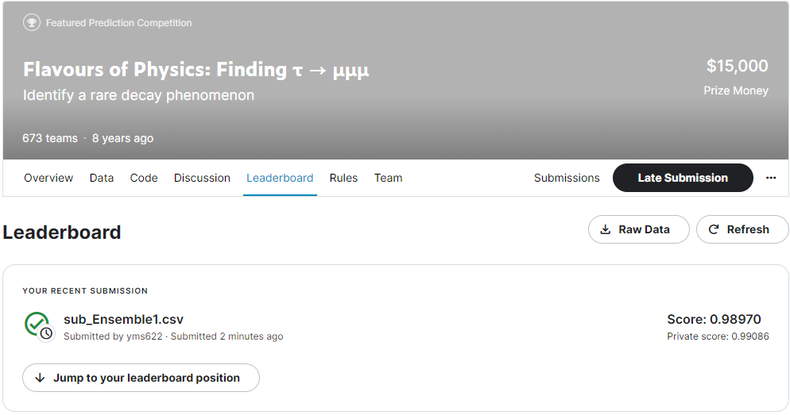
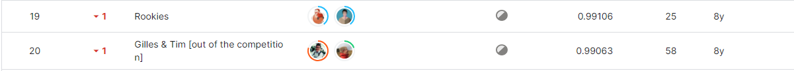

# Flavours of Physics: Finding τ → μμμ
-----------------------------------
# 결과
-----------------------------------
### 요약 정보
  * 도전기관 : SecuLayer
  * 도전자 : 윤민식
  * 최종 스코어 : 0.99086
  * 제출 일자 : 2023-07-04
  * 총 참여 팀수 : 673
  * 순위 및 비율 : 20 (2.9%)
# 결과 화면
-----------------------------------

# 사용한 방법 & 알고리즘
----------------------------------
  * 데이터 전처리 (물리학 이론 필요)
  * GradientBoostingClassifier과 XGBClassifier 1대1 비율로 앙상블
# 코드
----------------------------------
[Flavours of Physics,Finding](https://github.com/yms0606/SecuLayer/blob/main/Flavours%20of%20Physics%2CFinding/Flavours%20of%20Physics%2CFinding.ipynb)
# 참고자료
----------------------------------
