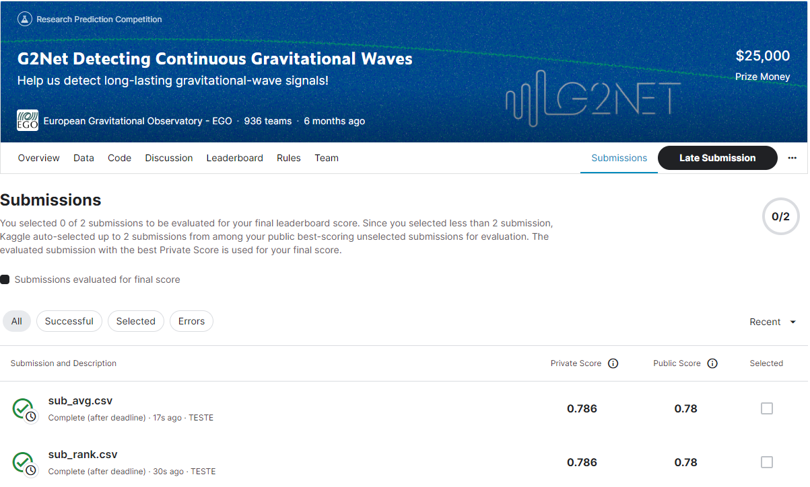

# g2net-detecting-continuous-gravitational-waves

---

# 결과

---

### 요약 정보

* 도전기관 : 시큐레이어
* 도전자 : 이준영
* 최종 스코어 : 0.786
* 제출 일자 : 2023-06-28
* 총 참여 팀수 : 936    
* 순위 및 비율 : 11(1.18%)

# 결과 화면

# 사용한 방법 & 알고리즘

---

* scipy.optimize.minimize
* scipy.optimize.fsolve

# 코드
[g2net-detecting-continuous-gravitational-waves](./g2net2-sub-avg.ipynb)

# 참고자료