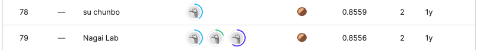
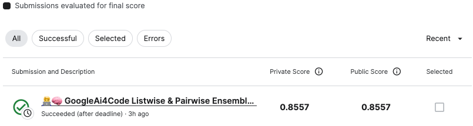
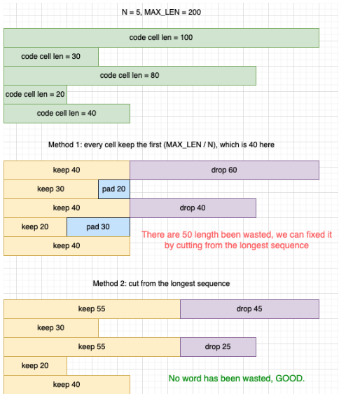
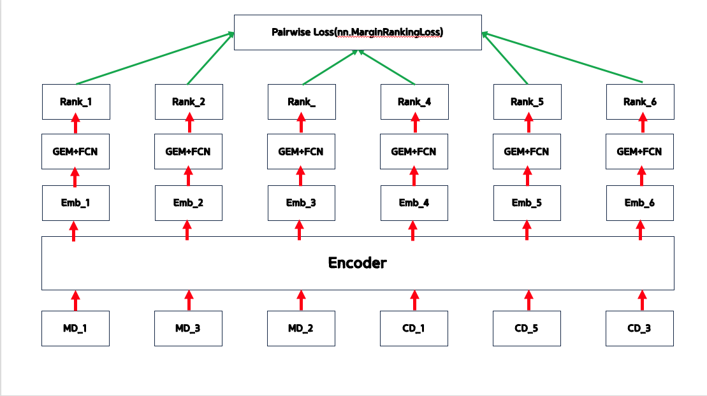

# Google AI4Code – Understand Code in Python Notebooks

## 요약 정보
* 도전기관 : 시큐레이어
* 도전자 : 이정환
* 최종 스코어 : 0.8557
* 제출 일자 : 2023-06-27
* 총 참여 팀수 : 1135
* 순위 및 비율 : 79 (6.9%)
___
## 결과 화면

___
## 대회 개요
- Python 노트북에서 코드와 주석 간의 관계를 이해하고 코드 셀의 순서에 따라 주어진 노트북에서 마크다운 셀의 순서를 재구성하는 모델을 만들고 데이터 필터링 및 전처리 파이프라인 구축 또는 노트북 가독성 자동 평가와 같은 AI 지원 개발의 여러 측면에서의 개선을 목표
___
## 사용한 방법 & 알고리즘
### **Pairwise Pipeline**  
**Part 0. Text Preprocessing**
* **Tokenize code text by python built-in tokenizer for code scanning**
    - Filtering by python built-in tokenizer
    - convert to string

* **Convert a markdown string to plaintext by beautifulsoup**
    - Remove all of html, css, link, markdown tage... etc from Original text for markdown by bs4

* **Cleaning Text**
    - Remove multi-spaces
    - Remove no character
    - Remove underbar & tokenize

**Part 1. Set Prompt Sentence Template**  
* **Prompt Sentence Template**  
    - [CLS] + [MD] + [Markdown_1] + [MD] + ... + [Markdown_K] + [MD] + [SEP] + [CD] + [Code_1] + ... + [CD] + [Code_P] + [CD] + [SEP]
    - Add Special Token to pretrained tokenizer for Markdown Cell & Code Cell
        - Markdown: [MD]
        - Code: [CD]
* **Data Augmentation**  
    - Cell Embedding Random Shuffle
    - [Markdown_20] + [Markdown_1] + [Markdown_3] + [Markdown_37] + ... + [Code_2] + [Code_3] + [Code_1] + [Code_51]
        - Trainable Relationship between each unique cell
        - 인코더 모델의 Bi-Directional한 특성 극대화 가능
* **Apply Dynamic Padding**

    - Tokenize input sentence to longer sequence than common tokenizing
    - Append padding strategy NOT Apply same max length, similar concept to dynamic padding
    Truncate longer sequence to match LLM max sequence
        - LLM Tokenizer Max_Length 기준으로 텍스트 패딩을 하게 되면 Context 손실이 매우 많아짐
        - 긴 시퀀스는 truncation, 짧은 시퀀스는 모두 0으로 패딩되기 때문
        - 따라서 짧은 시퀀스는 패딩하지 않고 긴 시퀀스를 최대한 많이 truncation해 패딩으로 인한 Context 손실을 최소화

**Part 2. Pairwise Pipeline**
* **Training Config**

    - Backbone: DeBERTa-V3-Large
    - Pooling: SubSequenceGEMPool(p=1, Meanpool)
        - pool subsequent of prompt sentence
    - Loss: MarginRankingLoss (Euclidean Distance Version of Pairwise Ranking Loss)
    - Metrics: Kendall Tau Correlation
    - Apply Freeze & Re-Init Encoders
    - Apply Layerwise Learning Rate Decay
    - Batch Size: 1  
    - Cross Validation: 5 Fold & Out of Folds
___
# 참고자료  
##### https://docs.python.org/3/library/tokenize.html
##### https://www.kaggle.com/code/haithamaliryan/ai4code-extract-all-functions-variables-names/notebook##### https://arxiv.org/pdf/2103.00020.pdf
##### https://gist.github.com/lorey/eb15a7f3338f959a78cc3661fbc255fe
##### https://www.kaggle.com/competitions/AI4Code/discussion/343714
##### https://github.com/louis-she/ai4code/blob/master/tests/test_utils.py#L6
##### https://paperswithcode.com/method/generalized-mean-pooling
##### https://pytorch.org/docs/stable/_modules/torch/nn/functional.html#margin_ranking_loss
##### https://pytorch.org/docs/stable/generated/torch.nn.MarginRankingLoss.html
##### https://arxiv.org/pdf/1705.00652.pdf
##### https://www.kaggle.com/competitions/AI4Code/discussion/343714
##### 
___