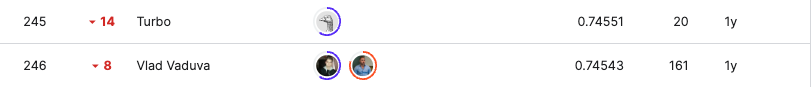
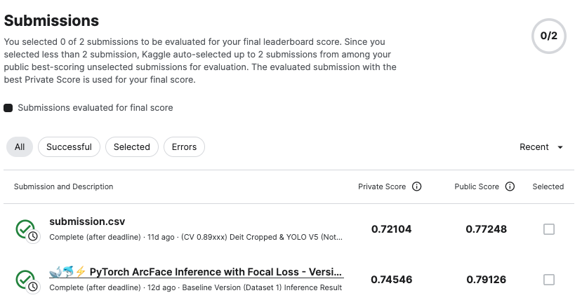

# HappyWhale - Whale and Dolphin Classification

## 요약 정보
* 도전기관 : 시큐레이어
* 도전자 : 이정환
* 최종 스코어 : 0.74546
* 제출 일자 : 2023-04-24
* 총 참여 팀수 : 1588
* 순위 및 비율 :  246 (15.49%)
___
## 결과 화면

___
## 대회 개요
- 고래 혹은 돌고래의 꼬리, 등지느러미, 머리 및 기타 신체 부위의 모양과 표시가 담긴 이미지를 활용해 개체군 자동 식별화 모델을 만드는 것이 목적
___
## 사용한 방법 & 알고리즘
### **[Two Stage Model: Embedding Lookup Table]** 
**Stage 0. Data Augmentation with DL**  
* **YOLO V5 Cropped Dataset**
    - Remove unnecessary background & Crop Target Object with resizing them by YOLO V5
* **Detic Cropped Dataset**
    - Remove unnecessary background & Crop Target Object with resizing them by Detic

**Stage 1. Make Embedding Lookup Table**  
* **Mix Two Augmented Image Data**  
    - Train Data: YOLO V5 Cropped Dataset + Detic Cropped Dataset

* **Make Image Embedding**  
    - Backbone: convnext_base_384_in22ft1k
    - Extract Image Embedding from Backbone's Last Two Layer and then concatenate them  

**Stage 2. Re-Rank Retriever Embedding by ArcFace**  
* **Re-Rank Retriever:**  
    - ArcFace with CrossEntropy
    - Image Semantic Search by FAISS (Facebook Library)
    - CV Metric: mAP@5
___
# 참고자료  
##### https://www.kaggle.com/competitions/us-patent-phrase-to-phrase-matching/overview
##### https://arxiv.org/abs/1801.07698
##### https://www.kaggle.com/competitions/happy-whale-and-dolphin/discussion/320298
##### https://www.kaggle.com/code/debarshichanda/pytorch-arcface-gem-pooling-starter
##### https://www.kaggle.com/competitions/happy-whale-and-dolphin/discussion/305503
##### https://www.kaggle.com/code/awsaf49/happywhale-cropped-dataset-yolov5
##### https://github.com/facebookresearch/Detic
___