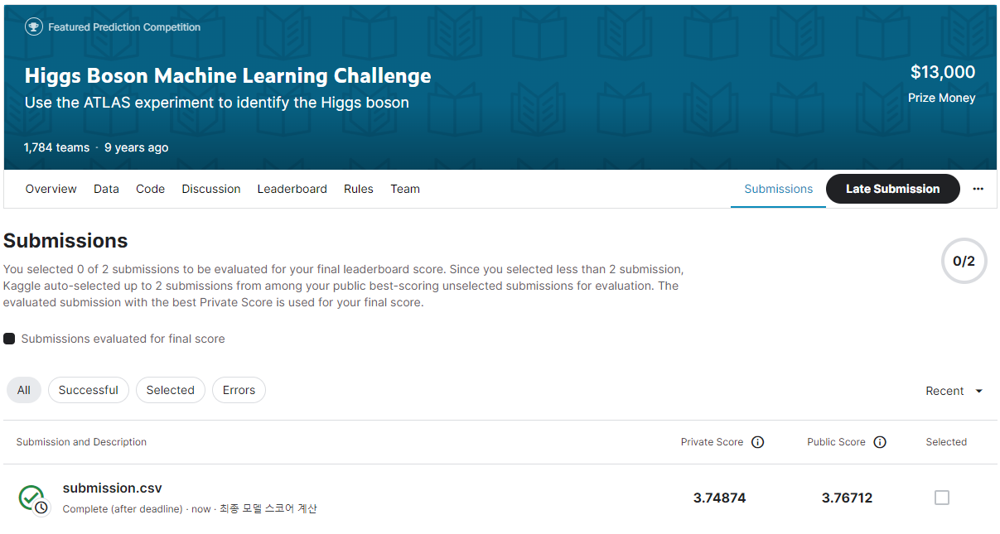
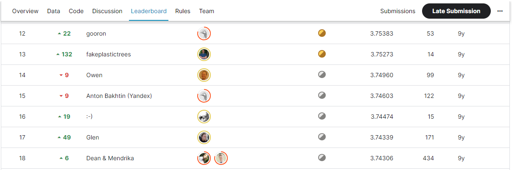

# Higgs Boson Machine Learning Challenge
## 결과
### 요약 정보
- 도전기관 : SecuLayer
- 도전자 : 김소영
- 최종 스코어 : 3.74874
- 제출 일자 : 2023-08-10
- 총 참여 팀수 : 1,784
- 순위 및 비율 : 15(0.8%)

## 결과 화면

## 사용한 방법 & 알고리즘
- Step 1. 데이터 전처리: 결측치 처리, 역로그 변수 생성, 데이터 스케일링(StandardScaler)
- Step 2. 모델: AdaBoostClassifier(estimator=ExtraTreesClassifier()) 모델

## 코드
- Higgs_Boson_Machine_Learning_Challenge.ipynb

## 참고자료