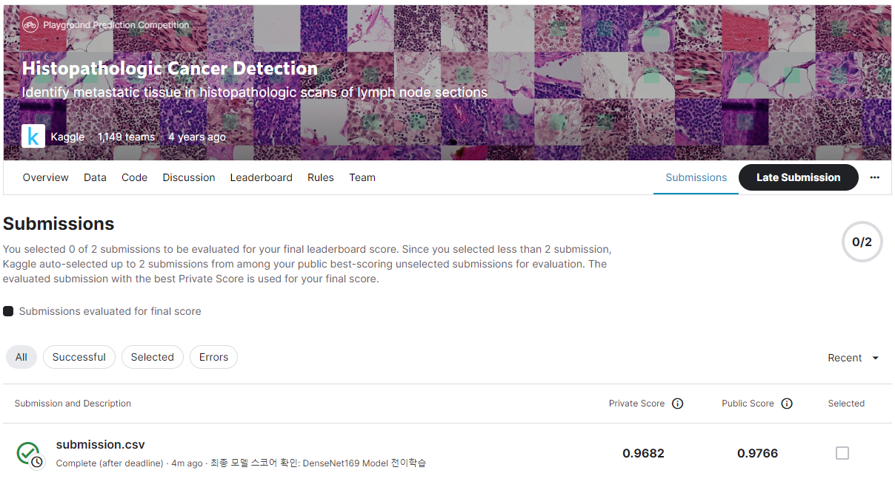
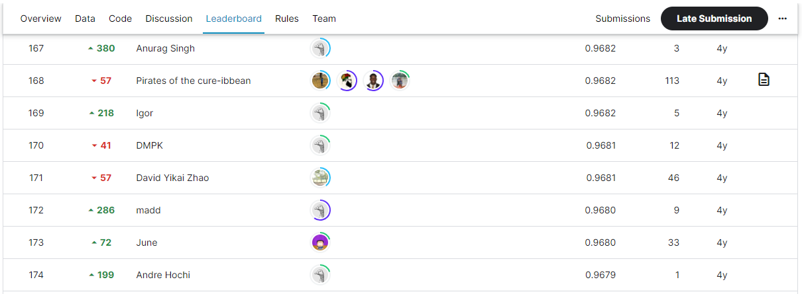

# Histopathologic Cancer Detection
## 결과
### 요약 정보
- 도전기관 : SecuLayer
- 도전자 : 김소영
- 최종 스코어 : 0.9682
- 제출 일자 : 2023-08-11
- 총 참여 팀수 : 1,149
- 순위 및 비율 : 170(14.8%)

## 결과 화면

## 사용한 방법 & 알고리즘
- Step 1. 데이터 전처리: Data augmentation
- Step 2. 모델: DenseNet169 model

## 코드
- Histopathologic_Cancer_Detection.ipynb

## 참고자료