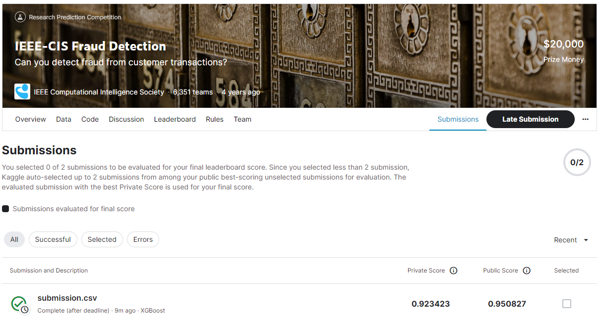
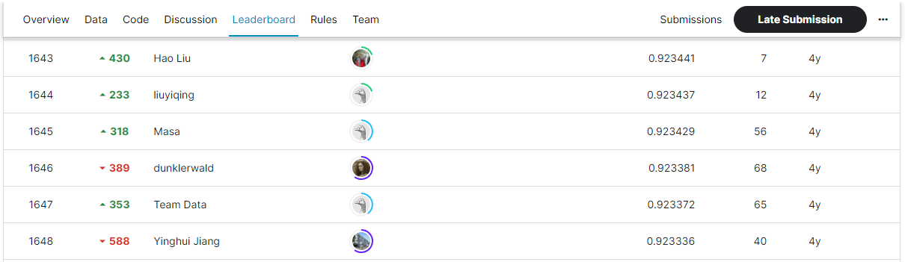

# IEEE-CIS Fraud Detection
## 결과
### 요약 정보
- 도전기관 : SecuLayer
- 도전자 : 김소영
- 최종 스코어 : 0.923423
- 제출 일자 : 2023-07-10
- 총 참여 팀수 : 6,351
- 순위 및 비율 : 1,646(25.9%)

## 결과 화면

## 사용한 방법 & 알고리즘
- Step 1. 데이터 전처리
- Step 2. XGBClassifier 모델(학습시 GPU 사용)

## 코드
- IEEE-CIS_Fraud_Detection.ipynb