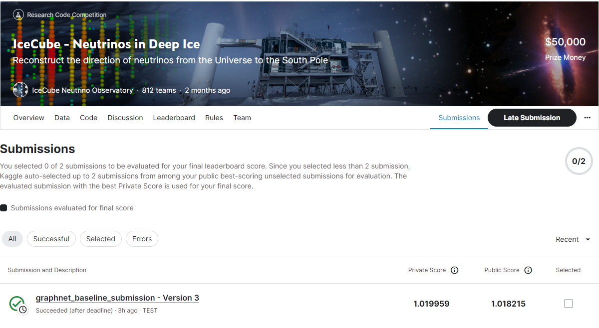
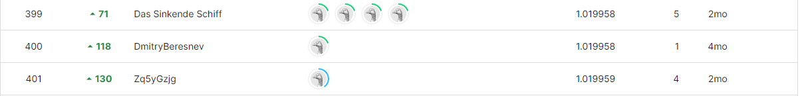

# icecube-neutrinos-in-deep-ice

---

# 결과

---

### 요약 정보

* 도전기관 : 시큐레이어
* 도전자 : 이준영
* 최종 스코어 : 1.019959
* 제출 일자 : 2023-06-28
* 총 참여 팀수 : 812    
* 순위 및 비율 : 401(49.38%)

# 결과 화면

# 사용한 방법 & 알고리즘

---

* StandarModel, IceCubeKaggle, DynEdge, DirectionReconstructionWithKappa, Adam, PiecewiseLinearLR

# 코드
[icecube-neutrinos-in-deep-ice](./graphnet-baseline-submission.ipynb)

# 참고자료