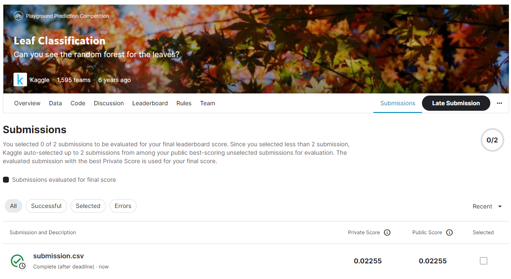
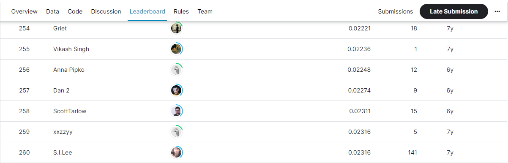

# Leaf Classification
## 결과
### 요약 정보
- 도전기관 : SecuLayer
- 도전자 : 김소영
- 최종 스코어 : 0.02255
- 제출 일자 : 2023-07-13
- 총 참여 팀수 : 1,595
- 순위 및 비율 : 257(16.1%)

## 결과 화면

## 사용한 방법 & 알고리즘
- Step 1. 데이터 전처리
  - 범주형 데이터 변환: LabelEncoder
  - 스케일 조정(스케일러): QuantileTransformer
- Step 2. LogisticRegression 모델

## 코드
- Leaf_Classification.ipynb