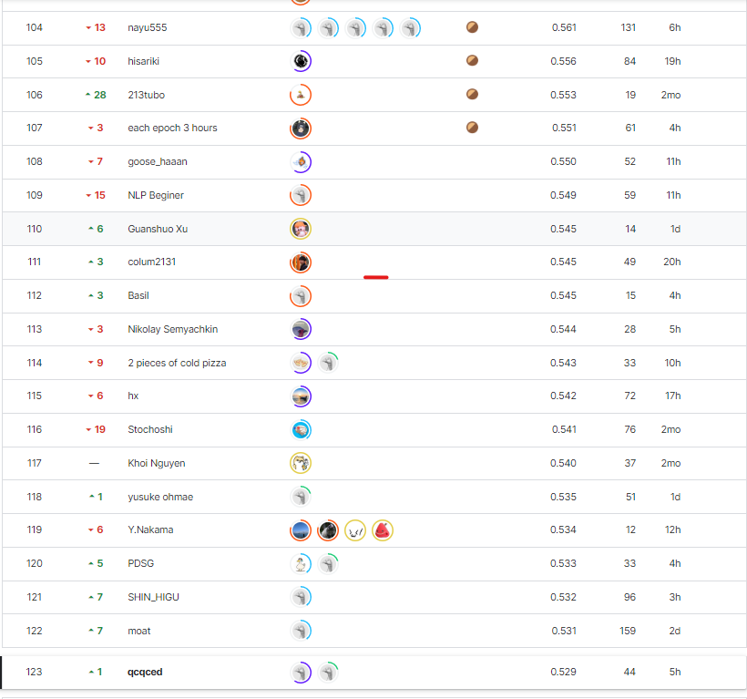
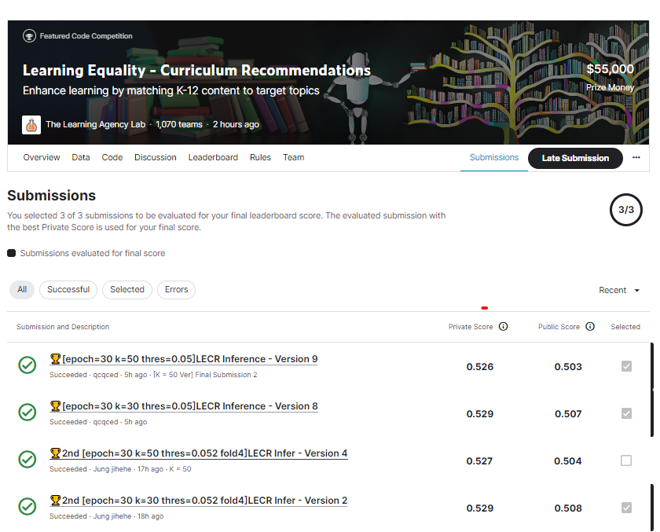

# Learning Equality - Curriculum Recommendations

## 요약 정보
* 도전기관 : 시큐레이어
* 도전자 : 이정환
* 최종 스코어 : 0.529
* 제출 일자 : 2023-03-15
* 총 참여 팀수 : 1070
* 순위 및 비율 : 123 (11.49%)
___
## 결과 화면

___
## 대회 개요
- 다국어로 구성된 데이터 세트를 활용, 개별 Topic에 가장 적합한 Content 추천
___
## 사용한 방법 & 알고리즘
### **[Four Stage Architecture]**  
**Stage 1. Extract Embedding by RetrieverLM**  
* **RetrieverLM**: sentence-transformers/paraphrase-multilingual-mpnet-base-v2  
* **Make Embedding:**  
    - topic embedding(**max_len==192**): title + desc + context(topic_tree)  
    - content Embedding(**max_len==64**): title + desc  
    - Multiple Negative Ranking Loss  

**Stage 2. Make Candidate for Re-RankerLM**  
* **Cluster topic & content by KNN**  
    - Cluster each topic & **Top 50** contents  
    - **Metric: Cosine Similarity**    

**Stage 3. Re-Rank Candidate**  
* **Re-RankerLM:** Fine-Tuned by Stage 1  
* **Input(max_len==256):** topic_embedding + [SEP] + content_embedding
* Loss: BCELoss  
* CV Score: F2-Score 

**Stage 4. Inference with Post-Processing**  
* **Blank** for topics that have **has_content==False**  
* Add Feature: **topic title==content title**  
* Remove result that has **different language** information to topic  

___
# 참고자료  
##### https://www.kaggle.com/competitions/learning-equality-curriculum-recommendations/overview
##### https://arxiv.org/abs/1908.10084
___