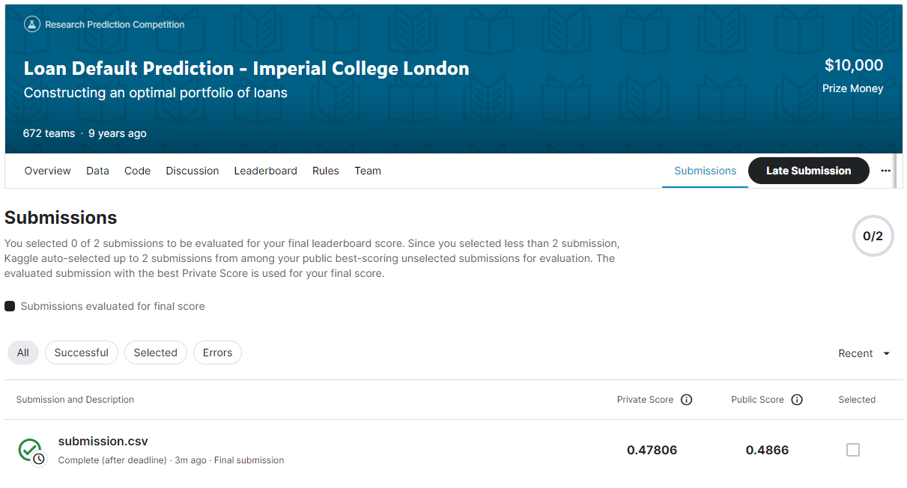
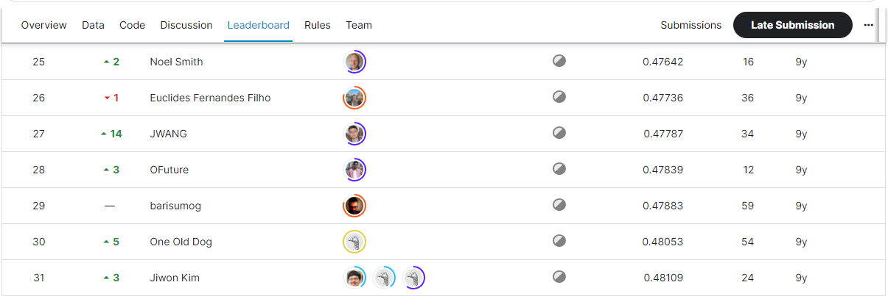

# Loan Default Prediction - Imperial College London
## 결과
### 요약 정보
- 도전기관 : SecuLayer
- 도전자 : 김소영
- 최종 스코어 : 0.47806
- 제출 일자 : 2023-08-03
- 총 참여 팀수 : 672
- 순위 및 비율 : 28(4.2%)

## 결과 화면

## 사용한 방법 & 알고리즘
- Step 1. 데이터 전처리: 변수 생성, 결측치 대체(중앙값), 데이터 스케일링(StandardScaler), 변수 제거(상관계수가 높은 변수)
- Step 2. 모델
  - 2-1. default 예측: LGBMClassifier 모델
  - 2-2. loss 예측: GradientBoostingRegressor 모델

## 코드
- Loan_Default_Prediction-Imperial_College_London.ipynb

## 참고자료