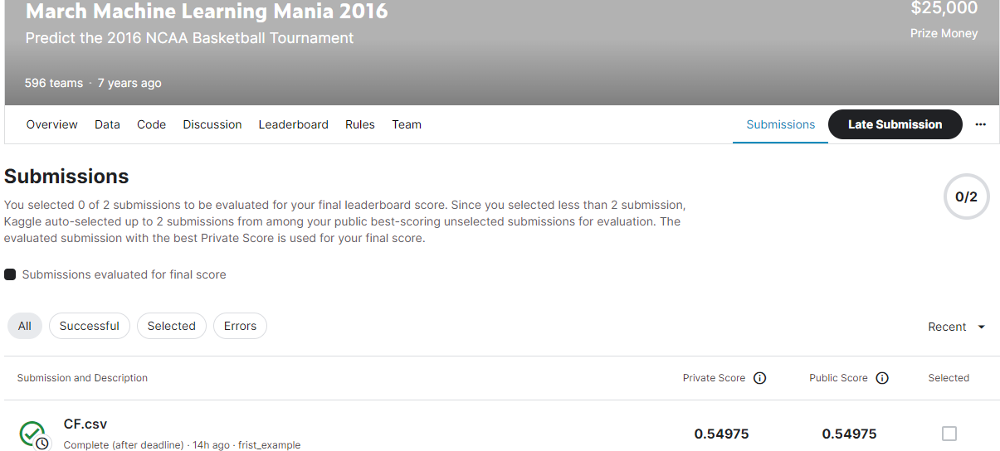
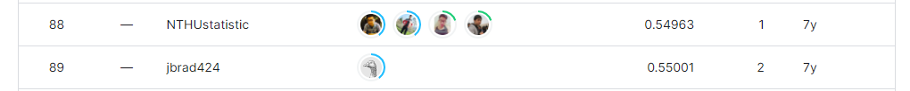

# March Machine Learning Mania 2016
-----------------------------------
# 결과
-----------------------------------
### 요약 정보
  * 도전기관 : SecuLayer
  * 도전자 : 윤민식
  * 최종 스코어 : 0.54975
  * 제출 일자 : 2023-06-22
  * 총 참여 팀수 : 596
  * 순위 및 비율 : 89 (14.9%)
# 결과 화면
-----------------------------------

# 사용한 방법 & 알고리즘
----------------------------------
  * team1 pred:1, team2 pred:0 으로 설정
  * team number를 embedding
  * keras 딥러닝 모델 구축
  * embedding한 값을 바탕으로 pred 값과 함께 분류 학습
# 코드
----------------------------------
[March_Machine_Learning_Mania_2016](./March_Machine_Learning_Mania_2016.ipynb)
# 참고자료
----------------------------------
[https://www.kaggle.com/code/midouuu/data-mining-mmn](https://www.kaggle.com/code/midouuu/data-mining-mmn)
