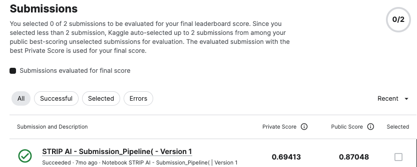
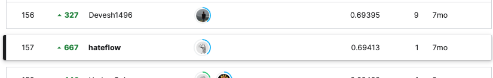

# Mayo Clinic - STRIP AI

## 요약 정보
* 도전기관 : 시큐레이어
* 도전자 : 이정환
* 최종 스코어 : 0.69413
* 제출 일자 : 2023-04-24
* 총 참여 팀수 : 888
* 순위 및 비율 : 157 (17.68%)
___
## 결과 화면

___
## 대회 개요
- 주어진 WSI 이미지를 활용해 두 가지 주요 급성 허혈성 뇌졸중(AIS) 병인의 하위 유형인 심장 및 대동맥 죽상경화증을 구별하는 모델을 구축, 허혈성 뇌졸중에서 혈전 기원을 분류하는 것을 목표
___
## 사용한 방법 & 알고리즘
### **[Two Model Ensemble]**  
**Stage 1. Image Pre-Processing**  
* **Seam-Carving(Remove unnecessary background)**
    - Resize original WSI to 1k with no unnecessary background
* **Stain-Color Normalization with skimage.staintool**
    - Apply Color Normalization for Resized Image
        (There are many different stain color for image, must need to normalize)  

**Stage 2. Train Two Model: Efficientnet-b0, ViT-L-16**  
* **Imbalanced Class: Apply WeightedRandomSampler with torch.utils.data**  
    - Apply weighted sampling ration for LAA class (Before, CE : LAA = 0.7 : 0.3)

* **Train:**  
    - Backbone Model: Efficientnet-B0, ViT-L-16
    - CrossEntropyLoss 
    - CV Metric: Roc Auc Score
___
# 참고자료  
##### https://www.kaggle.com/competitions/mayo-clinic-strip-ai/overview
___