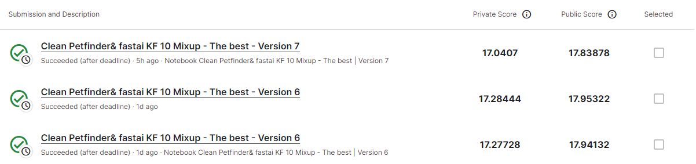
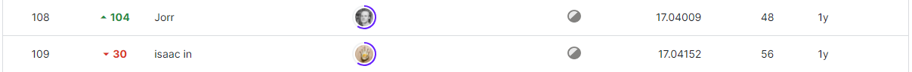

# PetFinder.my - Pawpularity Contest
-----------------------------------
# 결과
-----------------------------------
### 요약 정보
  * 도전기관 : SecuLayer
  * 도전자 : 윤민식
  * 최종 스코어 : 17.0407
  * 제출 일자 : 2023-07-07
  * 총 참여 팀수 : 3537
  * 순위 및 비율 : 109 (3.0%)
# 결과 화면
-----------------------------------

# 사용한 방법 & 알고리즘
----------------------------------
  * fastai 사용해 이미지 처리
  * fastai 사용해 모델 학습
# 코드
----------------------------------
[Petfinder.my - Pawpularity Contest.ipynb](https://github.com/yms0606/SecuLayer/blob/main/PetFinder.my%20-%20Pawpularity%20Contest/Petfinder.my%20-%20Pawpularity%20Contest.ipynb)
# 참고자료
----------------------------------
