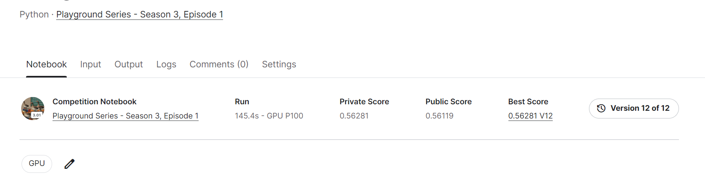

# Playground Series - Season 3, Episode 1

---
# 결과
---
### 요약 정보
* 도전기관 : 한양대학교
* 도전자 : 김용환
* 최종 스코어 :  0.56281
* 제출 일자 : 2023-04-03
* 총 참여 팀수 : 690
* 순위 및 비율 : 263 (38%)

# 결과 화면

# 사용한 방법 & 알고리즘
---
* Xgboost알고리즘 and XGBRegression방법
* K-fold cross validation
* Add and change the features

# 코드
---
[jupyter notebook code](playground-series-s3e1.ipynb)

# 참고자료
---
**Cartesian coordinates rotation** These features have given an increase in the metric.[PS S3E1 | Coordinates - key to victory | Kaggle](https://www.kaggle.com/code/dmitryuarov/ps-s3e1-coordinates-key-to-victory)

